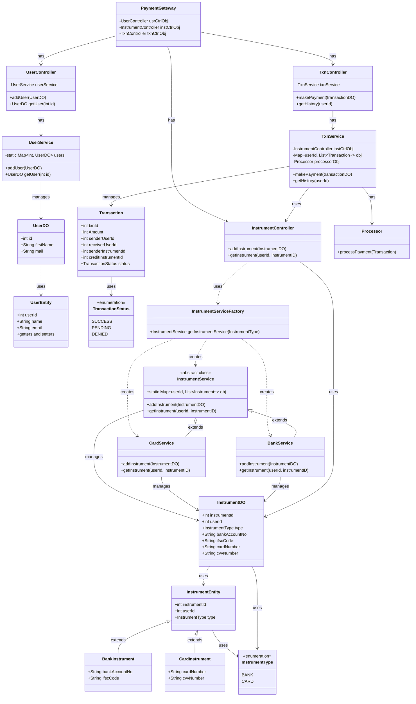
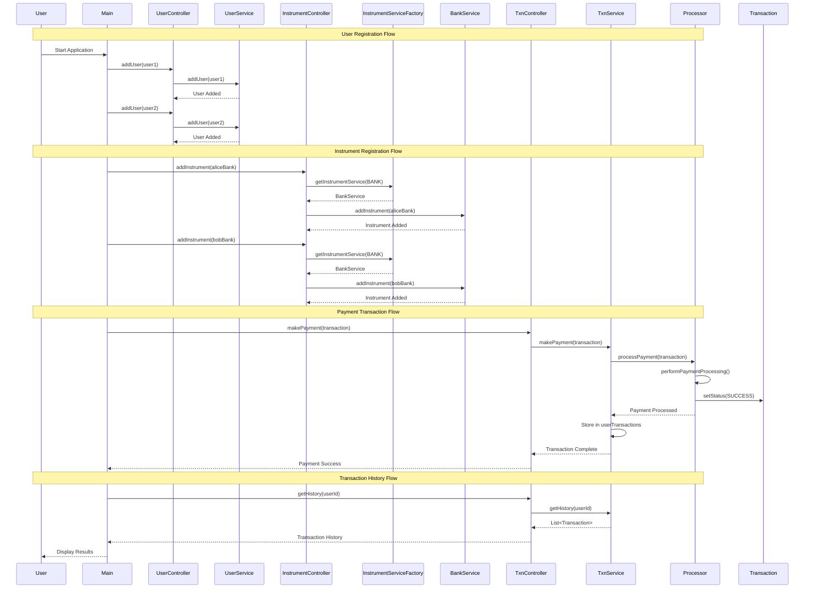

# Payment Gateway System

## Overview
A comprehensive payment gateway system that enables users to manage multiple payment instruments (bank accounts and credit cards) and perform secure transactions between users.

---

## Requirements

### Functional Requirements
- **User Management**: Create and manage user profiles with basic information
- **Instrument Management**: Support multiple payment instruments per user (Bank Accounts & Credit Cards)
- **Transaction Processing**: Enable payments between users using their registered instruments
- **Transaction History**: Track and retrieve transaction history for users
- **Payment Status**: Real-time status tracking (SUCCESS, PENDING, DENIED)

### Non-Functional Requirements
- **Extensibility**: Easy addition of new payment instrument types
- **Scalability**: Support for multiple concurrent transactions
- **Security**: Secure handling of sensitive payment information
- **Reliability**: Consistent transaction processing with proper error handling

---

## Objectives

1. **Flexible Payment Options**: Allow users to register and use multiple payment instruments
2. **Seamless Transactions**: Provide smooth payment flow between users
3. **Factory Pattern Implementation**: Use design patterns for instrument type management
4. **Service-Oriented Architecture**: Separate concerns with clear service boundaries
5. **Transaction Tracking**: Maintain comprehensive transaction history and status

---

## System Architecture

### Package Structure
```
com.payment.system
├── model          # Data Transfer Objects (DTOs)
├── entity         # Database entities
├── service        # Business logic layer
├── factory        # Factory pattern for instrument creation
├── controller     # Request handling layer
├── gateway        # Payment orchestration
└── processor      # Transaction processing
```

---

## UML Class Diagram



---

## Sequence Diagram - Payment Flow



---

## Key Design Patterns

### 1. Factory Pattern
- **InstrumentServiceFactory** creates appropriate service instances based on instrument type
- Enables easy addition of new payment instrument types

### 2. Strategy Pattern
- **InstrumentService** as abstract class with concrete implementations
- Different strategies for Bank and Card payment processing

### 3. MVC Pattern
- **Controllers**: Handle requests and coordinate between layers
- **Services**: Contain business logic
- **Models**: Data transfer objects

---

## Usage Example

```java
// Create users
UserDO alice = new UserDO(1, "Alice Smith", "alice@example.com");
UserDO bob = new UserDO(2, "Bob Johnson", "bob@example.com");
userController.addUser(alice);
userController.addUser(bob);

// Add payment instruments
InstrumentDO aliceBank = new InstrumentDO(101, 1, InstrumentType.BANK);
aliceBank.setBankAccountNo("1234567890");
aliceBank.setIfscCode("HDFC0001234");
instrumentController.addInstrument(aliceBank);

// Make payment
Transaction transaction = new Transaction(1001, 500);
transaction.setSenderUserId(1);
transaction.setReceiverUserId(2);
transaction.setSenderInstrumentId(101);
transaction.setCreditInstrumentId(201);
txnController.makePayment(transaction);

// Get transaction history
List<Transaction> history = txnController.getHistory(1);
```

---

## Future Enhancements

1. **Additional Payment Methods**: UPI, Digital Wallets, Cryptocurrency
2. **Security Features**: Encryption, Two-factor authentication, Fraud detection
3. **Database Integration**: Persistent storage with JPA/Hibernate
4. **RESTful APIs**: Expose services via REST endpoints
5. **Notification System**: Email/SMS notifications for transactions
6. **Refund Processing**: Handle transaction reversals and refunds
7. **Multi-currency Support**: International payment handling
8. **Transaction Limits**: Daily/monthly transaction limits per user

---

## Technologies Used

- **Java 21**: Core programming language
- **Spring Boot 4.0**: Framework (in classpath)
- **Maven**: Dependency management
- **Design Patterns**: Factory, Strategy, MVC

---

## Project Structure

```
Payment-Gateway/
├── src/
│   └── main/
│       └── java/
│           └── com/
│               └── payment/
│                   └── system/
│                       ├── model/
│                       ├── entity/
│                       ├── service/
│                       ├── factory/
│                       ├── controller/
│                       ├── gateway/
│                       ├── processor/
│                       └── Main.java
├── pom.xml
└── README.md
```

---

## Running the Application

1. Clone the repository
2. Build the project: `mvn clean install`
3. Run the Main class: `java com.payment.system.Main`

---


